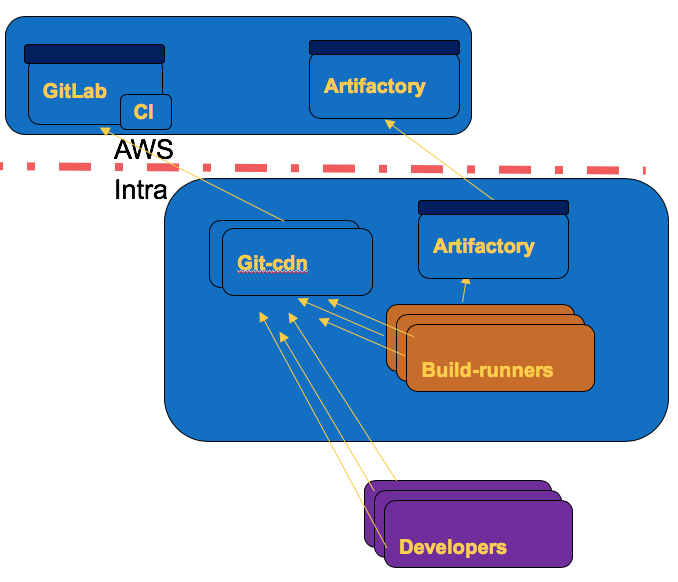

# git-cdn

a CDN for git

A git+http(s) proxy for optimising git server usage.

- Fully stateless for horizontal scalability

- Supports BasicAuth authentication (auth check is made by forcing a call to upstream, by reusing the BasicAuth creds)

- List of refs is always re-fetched from upstream (first step of the git+http(s) protocol)

  - with gitlab and gitaly, this should not be a problem as gitaly is supposed to cache that result.

- git-uploadpack part is always tried locally first, which greatly reduce the load on upstream, as uploadpack is typically not cacheable.

- Only supports http(s) and basicAuth. Doing similar proxy with ssh is much harder, because of the authentication check. SSH is not allowing MITM auth.

- Push (aka receive-pack) operations are implemented as a simple proxy, they will just forward to upstream server, without any smarts.
  This simplifies the git-config, avoiding to configure pushInsteadOf and http_proxy

- Tested with gitlab-ce 11.2, but should work with any BasicAuth git+http(s) server

# Run via docker

    docker run -p 8000:8000 -e GITSERVER_UPSTREAM=https://gitlab.mycompany.com/ -e WORKING_DIRECTORY=~/git-proxy forestscribe/git-cdn

It is recommended to put an nginx frontend for the SSL encyption

# How it works

Git HTTP protocol is divided into two phases.

During the first phase (GET), the client verify that the server is implementing RPC, and ask the list of refs that the server has for that repository.
For that phase, git-cdn acts as a simple proxy, it does not interfer in anyway with the results, nor uses any cached data. This allow to ensure that the client always has the latest commit.

Then, for the next phase, the client sends a POST message with the list of object that he has, and the list of object that he wants. The server is supposed to send him only the bare minimum of object in order to reconstruct the branch that is needed.
During that phase, git-CDN acts as a smart caching proxy, he sends the list of HAVE and WANTS to a local git process, and tries to resolve the client needs locally.
If that does not work, then it will try to fetch new data from the upstream server and then retry to resolve the client needs.
Git-cdn always use local git in order to fetch new data, in order to optimistically fetch all the new data from server.

## Retry States

    If the local cache fails to address the upload-pack request, several retries are made, and

    - If the directory does not exist, directly go to state 3
    - state 1: Retry after taking the write lock. Taking the write lock means a parallel request may have updated the database in parallel. We retry without talking to upstream
    - state 2: Retry after fetching every branches of upstream
    - state 3: Assuming the repository is corrupted, we remove the directory and clone from scratch
    - state 4: Failed to answer to the request, give up and forward the error

# Log and Trace

Git-cdn uses structured logging methodology to have context based structured logging.
As git-cdn is massively parallel using asyncio, this is necessary in order to follow any problematic request.

At the moment, only the main logic upload_pack.py is using contextual logging.

In order to enable structure logging you need to configure a GELF server and GELF port as environment variables

    GELF_SERVER=graylog.example.com:12201

Graylog is easy to setup logserver supporting gelf, and allowing to process and filter those logs.

contextual data is send with each log trace:

- `extra.ctx._id`: an unique ID for the upload-pack process. You can filter with this ID, in order to follow a transaction.
- `extra.ctx.input`: The input data of upload-pack
- `extra.ctx.upstream_url`: The full URL of the git project that is being mirrored
- `extra.state`: The current state of retries for this request (was `extra.num_try`)

# License

MIT
